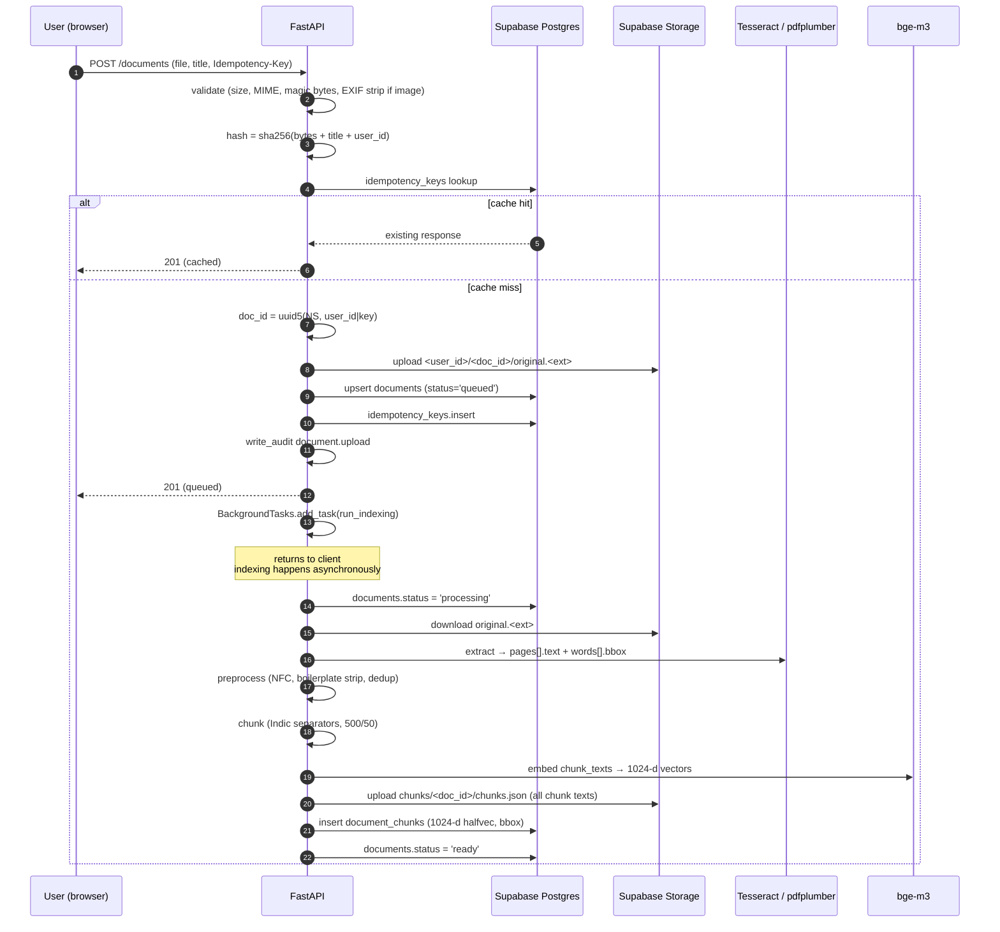
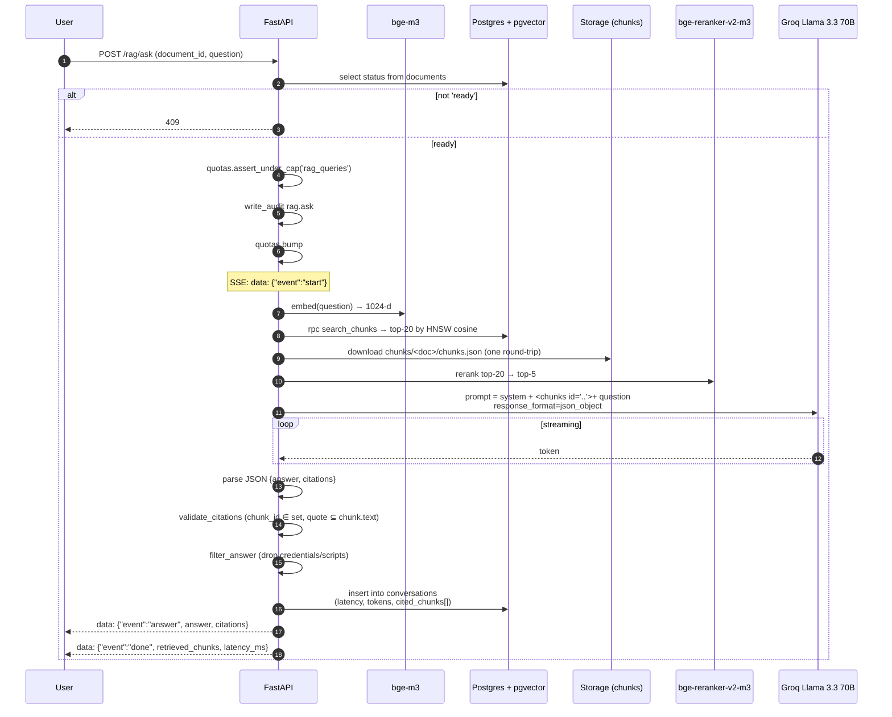
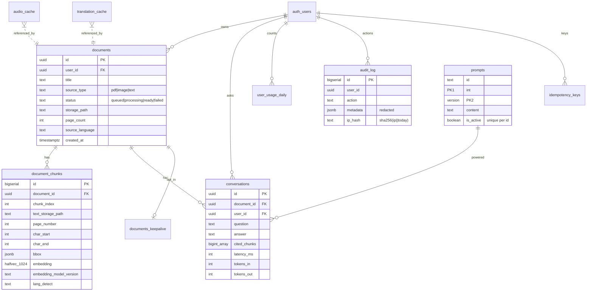
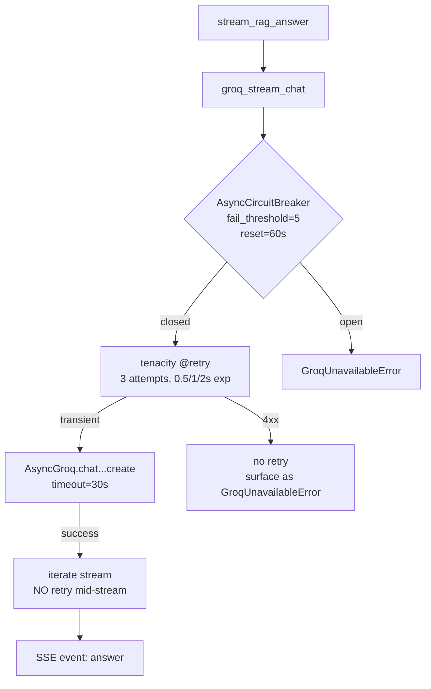

# Architecture

The authoritative plan is [`build plan.md`](../build%20plan.md).
This page is the **evergreen** view — the plan freezes at v1 launch, this
file moves with the code.

Diagrams use [Mermaid](https://mermaid.js.org). GitHub renders them inline
in the browser; in your IDE install the Mermaid preview extension.

---

## 1. System context

```mermaid
flowchart LR
    user([User])
    subgraph cf[Cloudflare Pages]
        spa[React SPA<br/>Vite + Tailwind]
    end
    subgraph hf[HF Spaces - Docker]
        api[FastAPI 3.11<br/>backend]
    end
    subgraph sb[Supabase ap-south-1]
        pg[(Postgres<br/>+ pgvector)]
        auth[Auth]
        st[(Storage)]
    end
    subgraph cpu[Local CPU - in container]
        bge1[bge-m3<br/>embed]
        bge2[bge-reranker-v2-m3]
        tess[Tesseract]
        piper[Piper TTS<br/>fallback]
    end
    groq[Groq API<br/>Llama 3.3 70B]
    edge[Edge-TTS<br/>Microsoft]
    sentry[Sentry]
    posthog[PostHog]
    r2[(Cloudflare R2<br/>backups)]

    user -- HTTPS<br/>JWT --> spa
    spa -- HTTPS<br/>Bearer JWT --> api
    spa -. magic link / OAuth .-> auth
    spa -. signed URLs .-> st
    api --> pg
    api --> auth
    api --> st
    api --> bge1
    api --> bge2
    api --> tess
    api --> piper
    api -- prompts + chunks --> groq
    api -- text --> edge
    spa -- traces 10% .-> sentry
    api -- traces 10% .-> sentry
    spa -- events post-consent .-> posthog
    pg -- daily pg_dump cron --> r2
```

### Trust boundary (one rule)

**The browser never holds a third-party API key.** All Groq / Gemini /
Edge-TTS / Sentry-DSN / PostHog-key are bundled or server-side; the
browser only ever has Supabase URL + anon key + the user's Supabase JWT.
CI's `no-client-side-ai` job (Day 20) blocks regressions.

---

## 2. Upload + indexing flow



---

## 3. RAG (ask-with-citation) flow



---

## 4. Data model (top-level)



Full DDL: [`infra/supabase/migrations/0001_initial_schema.sql`](../infra/supabase/migrations/0001_initial_schema.sql).

---

## 5. Reliability layers (Groq path)



Same pattern wraps `/translate` and the citation-judge path in eval.

---

## 6. Operational invariants (do not break)

- **No third-party API keys in the frontend bundle** — backend proxies everything.
- **Every chunk stores citation anchors** (`page_number`, `char_start`, `char_end`, `bbox`). Citation Mode depends on these.
- **Every user-facing table has Row-Level Security enabled.** Backend uses `user_client(JWT)` for user data, `admin_client()` only for backend-owned tables.
- **Caches are content-addressable** (sha256 of inputs). Never key on user IDs.
- **Rate limits enforced server-side** (slowapi per-IP) AND user-side (`user_usage_daily` quotas) even if the client forgets.
- **Idempotency keys on `POST /documents`** — replays converge on the same `doc_id`.
- **Audit row written BEFORE destructive actions** (delete account, prompt swap) so the trail survives the action.

---

## 7. Where to look next

| Want to know… | Go to |
|---|---|
| Why we chose Groq over Gemini | [adr/0001-stack-choice.md](adr/0001-stack-choice.md) §Decision |
| What runs in CI | [DEPLOY.md](DEPLOY.md) §CI gates |
| What pages, on whom | [SLOs.md](SLOs.md) §Alert routing |
| How to recover from a Sentry-pageworthy outage | [RUNBOOK.md](RUNBOOK.md) |
| What the `chunks` bucket layout looks like | this file §2 + `infra/supabase/migrations/0001_initial_schema.sql` |
